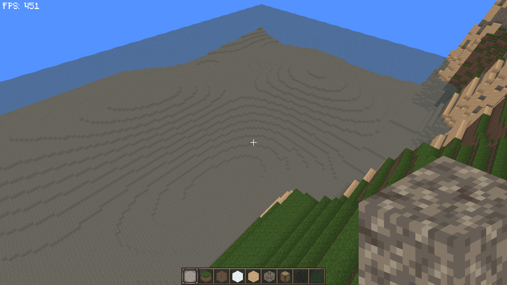
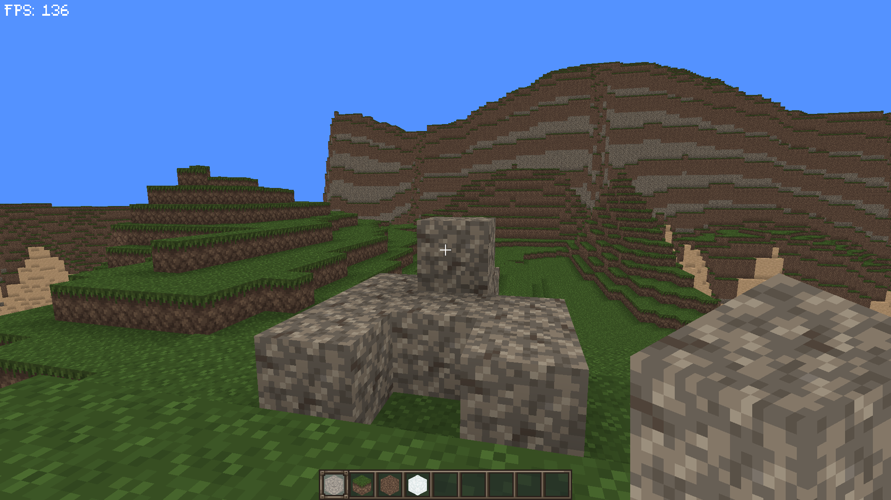
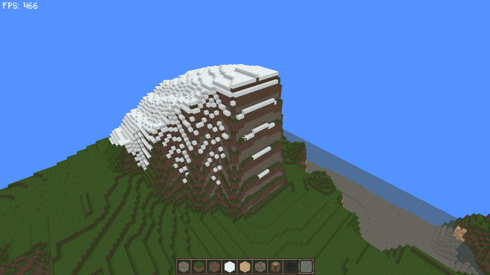

[]()

# OpenCubes

A voxel rpg game, that tries to look a bit like Hytale

## Screenshots

These are currently screenshots from the game (Game footage not final; graphics and features subject to change)

Currently i use textures from a resource pack called [Excalibur](https://www.curseforge.com/minecraft/texture-packs/excalibur "Excalibur: Curse Forge"). At some time i will create self made textures.

[]()

[]()

[]()

## Versions

I am currently working only on one version: Java

Sometime later i will bring a better version using C++

## Java
I currently use **Java 17**.

It's currently **work in progress**, so there will be many bugs and probably lags. Reporting them will be really helpful

## Developement

### IntelliJ

Open build.gradle as a project and you can start working instantly.

### Building and Running

Currently there is no main menu, starting it just throws you directly into the world.

If you want to run the client:

```
gradlew runClient
```

And build the game:

```
gradlew build
```


Starting the game requires a username argument, something like this:

```
java -jar (jarLocation) --username Dev
```
